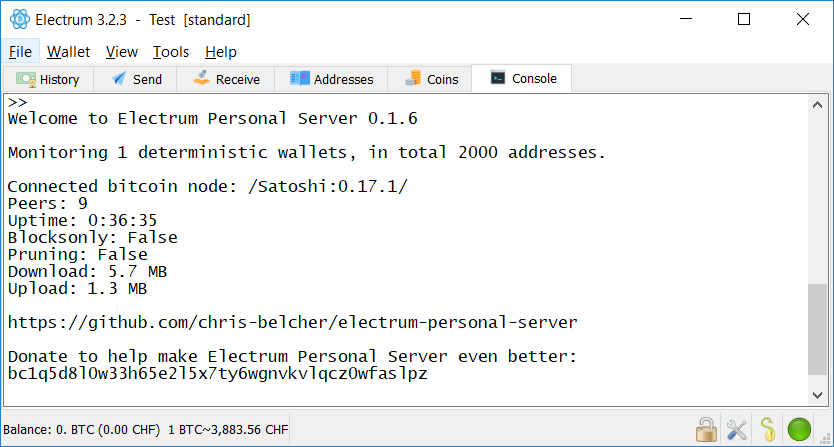
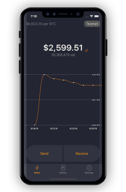
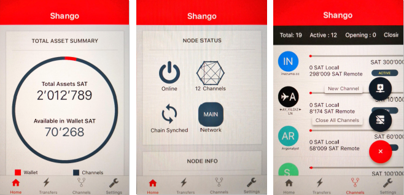

<!-- markdownlint-disable MD014 MD022 MD025 MD033 MD040 -->

# Bonus Section
{: .no_toc }

---

🚨 This section has not been updated to **RaspiBolt v2** yet.
There might be some inconsistencies with the updated configuration, so handle with care!

---
## Table of contents
{: .no_toc .text-delta }

1. TOC
{:toc}

---

In this section, you can find various optional topics that make your RaspiBolt running even smoother. I split this up in various subsections, as the individual tasks can be quite long.

## [System overview](raspibolt_61_system-overview.md)

*Difficulty: easy*

Your RaspiBolt will greet you with a quick system summary on login:

## [Auto unlock LND on startup](raspibolt_6A_auto-unlock.md)

*Difficulty: medium*

Manually unlocking the LND wallet every time the system starts is not really feasible if your RaspiBolt is meant to run reliably somewhere in a closet. This script automatically unlocks the wallet on startup or service-restart. This comes at a minimal security cost, however, as the password needs to be stored on the device.

## [Install a BTC RPC Explorer](raspibolt_6B_btc_rpc_explorer.md)

*Difficulty: easy*

Browse the blockchain in a private and autonomous way using data from your own node. You can also check different stats of your node and network.

## [Anonymous node with Tor](raspibolt_69_tor.md)

*Difficulty: medium*

Route all your Bitcoin traffic over the Tor network to stay anonymous and avoid leaking private information like your public IP address.

## [Electrum Personal Server](raspibolt_64_electrum.md)

*Difficulty: intermediate*

The RaspiBolt is the perfect trustless Bitcoin backend for your regular on-chain transactions. Together with the Electrum wallet, it works even with your Ledger or Trezor hardware wallet.

## [Zap Desktop Lightning Wallet](raspibolt_71_zap.md)

*Difficulty: easy*

The Zap desktop app (https://github.com/LN-Zap/zap-desktop) is a cross platform Lightning Network wallet focused on user experience and ease of use.

## [Zap iOS Lightning Wallet](raspibolt_72_zap-ios.md)

*Difficulty: medium*

The Zap iOS app (https://zap.jackmallers.com) provides a neat interface for the RaspiBolt to manage peers & channels, make payments and create invoices.

## [Shango Mobile Wallet](raspibolt_68_shango.md)

*Difficulty: intermediate*

The iOS & Android app Shango provides a neat interface for the RaspiBolt, to manage peers & channels, make payments and create invoices.

## [lntop](raspibolt_74_lntop.md)

*Difficulty: easy*

lntop is an interactive text-mode channels viewer for Unix systems.

## [Pimp the command line](raspibolt_62_commandline.md)

*Difficulty: easy*

Make your command line prompt shine with a golden ฿ and use more colors overall:

## [Use lncli on a different computer](raspibolt_66_remote_lncli.md)

*Difficulty: easy*

Control your Lightning node from a different computer within you network, eg. from a Windows machine.

## [SSH using Trezor (or other hardware wallet)](raspibolt_75_trezor-agent.md)

*Difficulty: easy*

Harden your Raspibolt by requiring your hardware wallet to SSH to your Pi

## [System recovery](raspibolt_65_system-recovery.md)

Difficulty: easy

In case your microSD card gets corrupted or you brick your node, it's handy to have a quick recovery image at hand. It's not a full backup solution, but allows a system recovery.

## [Additional scripts: show balance & channels](raspibolt_67_additional-scripts.md)

Difficulty: easy

These additional bash scripts display a balance overview (on-chain & in channels, active & inactive) as well as a nicely formatted channels overview.

## Even more Extras

**[RaspiBolt-Extras](https://github.com/robclark56/RaspiBolt-Extras/blob/master/README.md)** by Rob Clark
* Lights-Out: automatic unlocking of wallet and dynamic ip
* RaspiBoltDuo: testnet & mainnet running simultaneously
* Using REST access
* Receiving Lightning payments: automatically create invoices / qr codes

------

Next: [Troubleshooting](raspibolt_70_troubleshooting.md) >>
